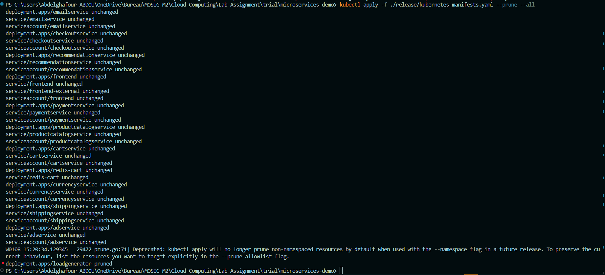
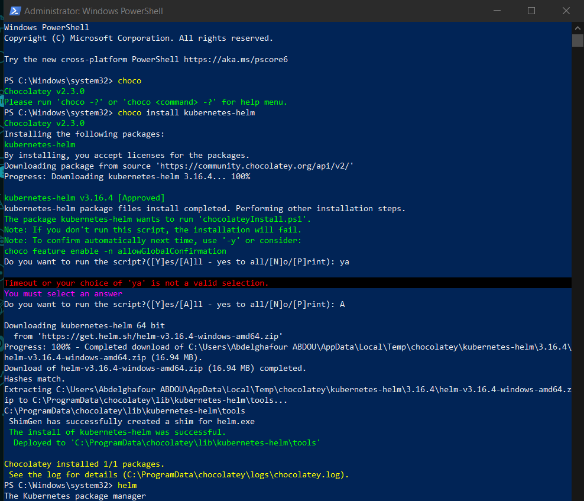
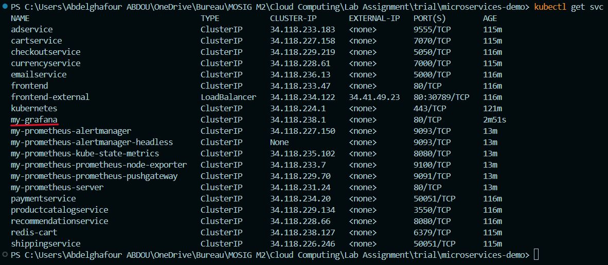
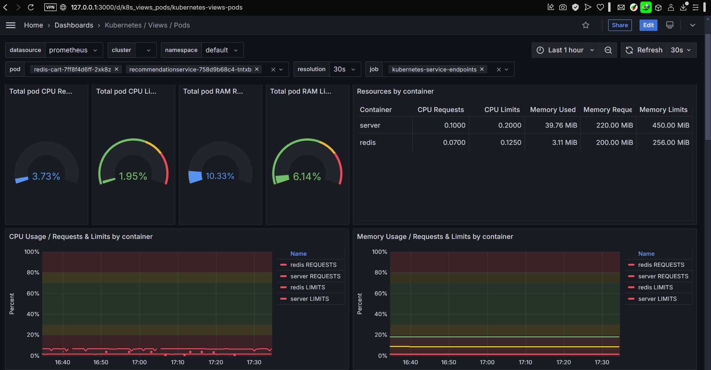
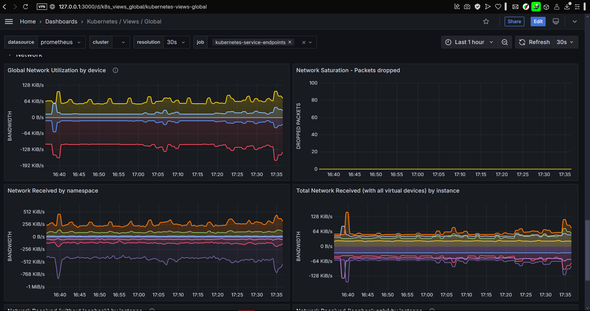
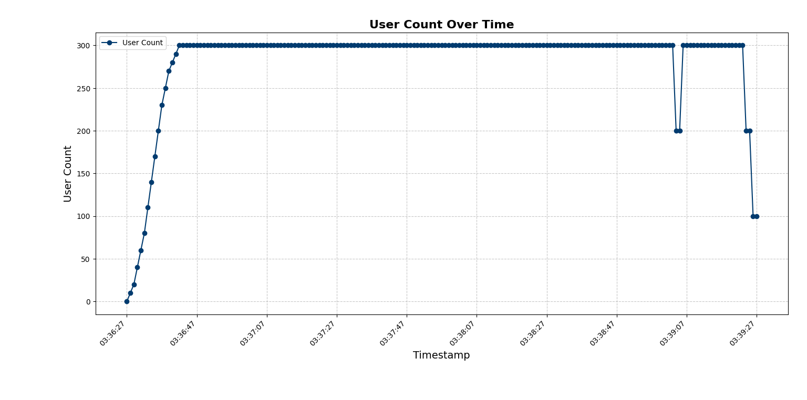
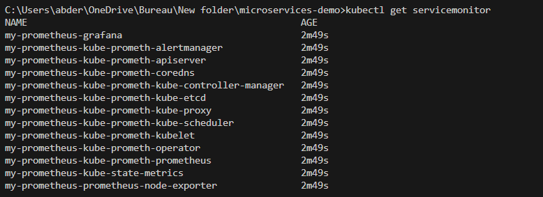
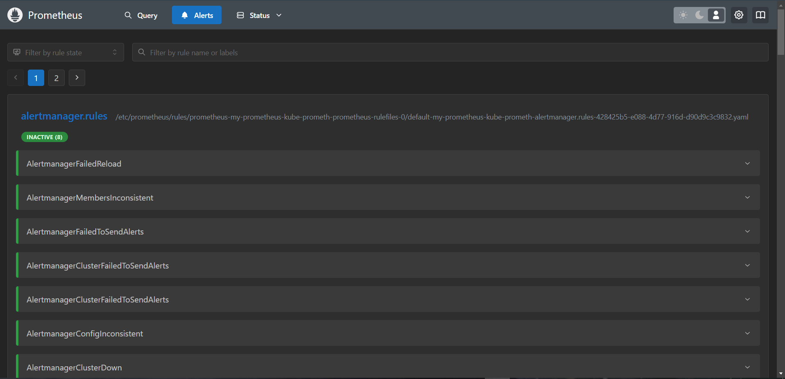
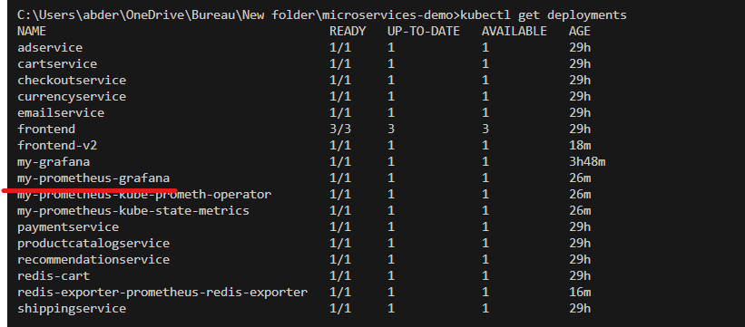

# Steps

The names of the participants:

- Abdelghafour ABDOU
- Abderrafii ABDOU

Steps:

- Step 1: Deploying the original application in GKE (code utilized is the original one from the official repository)
- Step 2: Analyzing the provided configuration (no code changed)
- Step 3: Deploying the load generator on a local machine (Step 3 Code)
- Step 4: Deploying automatically the load generator in Google Cloud (Step 4 Code)
- Step 5: Monitoring the application and the infrastructure (no code changed)
- Step 6: Performance evaluation (Step 6 Code)
- Step 7: Canary releases (Step 7 Code)
- Step 8: Monitoring the application and the infrastructure [Bonus] (Step 8 Code)
- Final Step: Autoscaling [Bonus] (Final Step Code)

## Deploying the original application in GKE

### 1 - Clone the latest major version

Locally, clone the files from the repository.

``` bash
git clone --depth 1 --branch v0 https://github.com/GoogleCloudPlatform/microservices-demo.git
```


Move to it:

``` bash
cd .\microservices-demo\
```

### 2 - Set the Google Cloud project and region and ensure the Google Kubernetes Engine API is enabled

Move to the Cloud Shell and run the commands:

``` bash
export PROJECT_ID=cloudlabapoli
export REGION=us-central1
gcloud services enable container.googleapis.com --project=${PROJECT_ID}
```

After running the commands, a login window appears, login to finish this step.


### 3 - Create a GKE cluster

Run:

``` bash
gcloud container clusters create online-boutique --zone=us-central1-a --num-nodes=4 --machine-type=e2-standard-2
```

(It will take some time.)


### 4 - Deploy Online Boutique to the cluster

Locally, run:

``` bash
kubectl config get-contexts # supposed to have an empty answer
gcloud container clusters get-credentials online-boutique --zone=us-central1-a
kubectl config get-contexts # now it should be filled
kubectl apply -f ./release/kubernetes-manifests.yaml
```


### 5 - Check that the Pods are Deployed and Running

Run:

``` bash
kubectl get pods
```


### 6 - Access the web frontend in a browser using the frontend's external IP

Move to the Cloud Shell and run:

``` bash
kubectl get service frontend-external | awk '{print $4}'
```


Visit **<http://34.57.249.242>**


## Analyzing the provided configuration

I have chosen to analyze the **currencyservice.yaml**

``` yaml
apiVersion: apps/v1 # specifies the version of the Kubernetes API used to create this resource (Deployment in this case) and that it will adhere to. It ensures compatibility between the YAML file and the Kubernetes cluster. apps/v1 is more advanced than v1 and it is used to handle scalable workloads and application lifecycles. Kubernetes API app/v1 is used for Deployment objects.
kind: Deployment # specifies that we will be creating a Deployment object, which is a logical collection of one or more replicas of a particular application, and it ensures that the specified number of replicas are always running and handles replicas' creation and replacement if any replicas fail or get deleted. This way, Deployments effectively handle the lifecycle and scaling concerns of the set of replicas.
metadata: # the Deployment's metadata that helps identify and organize resources within the cluster.
  name: currencyservice # specifies the name of the Deployment to be currencyservice, allowing it to be uniquely identified.
  labels: # labels to identify the Deployment. Labels are usually used for the categorization and grouping of resources based on key-value pairs, and they are commonly used to select resources with selectors or to apply Deployments.
    app: currencyservice # a label for identification, the key is app, and the value is currencyservice.
spec: # the specification and the desired state of the Deployment. It is used to specify the configuration and behavior of the resource and it changes depending on the kind of the resource. For Deployments, it includes the details of the number of replicas, container specifications like image and ports, and environment variables, etc.
  selector: # defines labels to be used for matching the Pods that will be managed by this Deployment. In general, selectors are used to select resources based on labels.
    matchLabels: # specifies the labels that the set of replicas created by the Deployment should use to select the Pods it manages, in other words, it matches the Pods with key-value labels.
      app: currencyservice # matches Pods with the key: app, and the value: currencyservice.
  template: # specifies the Pod template used by the Deployment to create Pods.
    metadata: # the Pod's metadata that helps identify and organize resources within the cluster.
      labels: # labels to identify the Pods created by this Deployment.
        app: currencyservice # a label for identification, the key is app, and the value is currencyservice
    spec: # the specification and configuration of the Pods created by this Deployment.
      serviceAccountName: currencyservice # specifies the name of the service account of the Pod to be currencyservice. Service accounts are non-human accounts that provide indentity in a cluster, allowing Pods to access the Kubernetes API.
      terminationGracePeriodSeconds: 5 # specifies 5 seconds to be the grace period for the Pod to terminate cleanly before being forcefully terminated.
      securityContext: # defines the security settings of the Pods created by this Deployment.
        fsGroup: 1000 # sets the group ID to be 1000 for file system operations within the Pod, it is a way to specify who owns the volume's files directories.
        runAsGroup: 1000 # sets the primary group ID to be 1000 for the processes in the container. It is useful when multiple users (or containers) in a Pod need to share resources or privileges.
        runAsNonRoot: true # makes sure that the container runs as a non-root user.
        runAsUser: 1000 # specifies the user ID to be 1000, under which the container runs. It is also the user ID that runs the first process in the container and it gives a more fine-grained control over the user ID.
      containers: # defines and configures the containers that will run in the Pod.
      - name: server # sets the name of the container to be server.
        securityContext: # sets some container-specific security settings
          allowPrivilegeEscalation: false # controls whether a process can gain more privileges than its parent process. In this case, it prevents the container from gaining privileges that exceeds its parent process.
          capabilities: # capabilities are a fine-grained permission model that allows a process to perform privileged operations without needing to run as a superuser or root and by default, containers that run as root are granted a wide set of capabilities that could expose the system to security risks.
            drop:
              - ALL # drops all linux kernel capabilities to enhance security, making sure that the container does not have elevated privileges.
          privileged: false # prevents the container from running in privileged mode.
          readOnlyRootFilesystem: true # mounts the container's root filesystem as read-only.
        image: currencyservice # specifies the Docker image to use for this container to be currencyservice.
        ports: # defines and sets the ports to open and expose by the container.
        - name: grpc # names the port grpc, and it could be used by the Service to direct traffic as well, and by readinessProbe and livenessProbe to check the readiness and liveness of the container.
          containerPort: 7000 # sets the container to listen on port 7000.
        env: # sets the environment variables of the container.
        - name: PORT # sets the name of the environment variable to PORT.
          value: "7000" # sets the value of the environment variable PORT to 7000.
        - name: DISABLE_PROFILER # this environment variable controls profiling
          value: "1" # disables profiling by setting the environment variable DISABLE_PROFILER to 1
        readinessProbe: # sets a readiness probe that checks if the container is ready to start accepting traffic.
          grpc:
            port: 7000 # uses gRPC on port 7000 to check if the container is ready
        livenessProbe: # sets a liveness probe to check if the container is running properly and helps to determine when to restart a container.
          grpc:
            port: 7000 # uses gRPC on port 7000 to check if the container is alive and healthy.
        resources: # sets the resources' requests and limits, in other words, it sets the container's min and max hardware resources to be used.
          requests: # sets the minimum guaranteed amount of a resource that is reserved for a container
            cpu: 100m # sets the container to have at minimum 100m CPUs or 0.1 vCPU to use.
            memory: 64Mi # sets the container to have at minimum 64 MiB of RAM to use.
          limits: # sets the maximum amount of a resource to be used by a container that cannot be exceeded.
            cpu: 200m # sets the container to have at maximum 200m CPUs or 0.2 vCPU to use.
            memory: 128Mi # sets the container to have at maximum 128 MiB of RAM to use.
---
apiVersion: v1 # specifies the version of the Kubernetes API used to create this resource (Service in this case) and that it will adhere to. It ensures compatibility between the YAML file and the Kubernetes cluster. v1 is the first stable release of the Kubernetes API and it contains the core objects. Kubernetes API v1 is used for Service objects.
kind: Service # specifies that we will be creating a Service object, which is a gateway for accessing the application, enabling network access, seamless communication, and load balancing. In other words, a Service object is a method for exposing a network application that is running as one or more Pods in your cluster
metadata: # the Service's metadata that helps identify and organize resources within the cluster.
  name: currencyservice # specifies the name of the Service to be currencyservice, allowing it to be uniquely identified.
  labels: # labels to identify the Service, used for the categorization and grouping of resources.
    app: currencyservice # a label for identification, the key is app, and the value is currencyservice.
spec: # the specification and the desired state of the Service. It is used to specify the configuration and behavior of the resource and it changes depending on the kind of the resource. For Services, it includes how it selects Pods, exposes them, routes traffic, etc.
  type: ClusterIP # creates a Service that is accessible only within the Kubernetes cluster, it is a Pod-to-Pod communication within the same Kubernetes cluster opposite to NodePort and LoadBalancer Services that are used for communication between applications within the cluster and external clients outside the cluster 
  selector: # sets labels to be used for matching the Pods that will be managed by this Service. In general, selectors are used to select resources based on labels.
    app: currencyservice # matches Pods with the label app: currencyservice, in other words, it matches Pods with the key: app, and the value: currencyservice.
  ports: # sets the ports exposed by the Service.
  - name: grpc # names the port grpc.
    port: 7000 # sets the Service to listen on port 7000.
    targetPort: 7000 # sets the Service to route traffic directed to the target Pods to use port 7000 of the Pods.
---
apiVersion: v1 # specifies the version of the Kubernetes API used to create this resource (ServiceAccount in this case) and that it will adhere to. It ensures compatibility between the YAML file and the Kubernetes cluster. v1 is the first stable release of the Kubernetes API and it contains the core objects. Kubernetes API v1 is used for ServiceAccount objects.
kind: ServiceAccount # specifies that we will be creating a ServiceAccount object, which is a type of non-human account that provides a distinct identity in a Kubernetes cluster to interact with the Kubernetes API. In other words, it provides an identity for processes that run in a Pod.
metadata: # the ServiceAccount's metadata that helps identify and organize resources within the cluster.
  name: currencyservice # specifies the name of the ServiceAccount to be currencyservice, allowing it to be uniquely identified. This ServiceAccount is used by the Deployment for Pod authorization.
```

## Deploying the load generator on a local machine

Edit the file at ./release/kubernetes-manifests.yaml by commenting out the loadgenerator Deployment and ServiceAccount so that the loaggenerator is no longer part of the cluster.


Then change the config of the cluster by rerunning the command:

``` bash
kubectl apply -f ./release/kubernetes-manifests.yaml  --prune --all
```

Before:

The command result:

After (the loadgenerator is no longer part of the cluster):


I chose to run the loadgenerator on my personal machine.
To do that, go to **./src/loadgenerator/Dockerfile**, and change the **${FRONTEND_ADDR}** to the External IP that we got earlier:


In the same directory run the following command to create the docker image:

``` bash
docker build --tag loadgenerator .
```


The docker image is created:

Use the docker image in a docker container:

As you can notice in the last image, the loadgenerator is running on my machine. It is sending requests and the failure/s is 0.

## Deploying automatically the load generator in Google Cloud

To start, download Terraform and make sure it is properly setup.


Create a new Service Account for the external loadgenerator and call it externalLoadGenerator with the following command:

``` bash
gcloud iam service-accounts create externalLoadGenerator
gcloud projects add-iam-policy-binding cloudlabapoli --member serviceAccount:externalLoadGenerator@cloudlabapoli.iam.gserviceaccount.com --role roles/editor
```


The newly created Service Account will have a default email address: <externalLoadGenerator@cloudlabapoli.iam.gserviceaccount.com>

Give the Service Account externalLoadGenerator with the email <externalLoadGenerator@cloudlabapoli.iam.gserviceaccount.com> the Editor role to allow it to access resources in my project: cloudlabapoli with:

``` bash
gcloud projects add-iam-policy-binding cloudlabapoli --member serviceAccount:externalLoadGenerator@cloudlabapoli.iam.gserviceaccount.com --role roles/editor
```


Create a key for the newly created Service Account with the Editor role, externalLoadGenerator, and save it locally to use it later by running:

``` bash
gcloud iam service-accounts keys create ./externalLoadGenerator.json --iam-account externalLoadGenerator@cloudlabapoli.iam.gserviceaccount.com
```


Now to use Terraform, we need to create a loadgenerator.tf which is a Terraform file that uses the saved key, the project name, and zone to select the project. In addition, we create an SSH-key to access the VM remotely and we specify the machine type and container image to spin up the VM.


Then, Upload the bash file of the commands to run on the newly created VM through SSH. After the VM is up, the bash file is run and the VM is working as the external load generator.


To use the bash file, we need to upload the files it will be using (Dockerfile, locustfile.py, requirements.txt and requirements.in) to a public S3 bucket for example to download and use to create the docker image and container that will run in the VM. It doesn't have to be AWS S3 specifically, any kind of bucket or file storage would do, I chose S3 because I am familiar with it and because it allows you to make your files public and you can download them without authentication.


We are now ready to use Terraform, starting with initialization, planning, and applying the plan.

``` bash
terraform init
```


``` bash
terraform plan -out plan.out
```


``` bash
terraform apply "plan.out"
```


(I skipped most of the file because it is too long.)

The result:


As you can see the requests are being sent successfully from an external VM.

## Monitoring the application and the infrastructure

I chose to use the Kubernetes package manager, Helm, to add and install Prometheus and Grafana because Helm simplifies adding packages so much. I installed it through choco:

``` bash
choco install kubernetes-helm
```



Helm simplifies Kubernetes resource management through charts, which are packaged applications. First, we add the Helm Repository we would like to install (Prometheus and Grafana for me):

``` bash
helm repo add prometheus-community https://prometheus-community.github.io/helm-charts
```


Then, update it to make sure we have the latest version:

``` bash
helm repo update
```


Then, install it:

``` bash
helm install my-prometheus prometheus-community/prometheus
```


The installation was successful (N.B. The Prometheus Chart includes the following additional exporters: cAdvisor and node exporter and uses them in the Prometheus configuration YAML):


We will follow the same steps to install Grafana:

``` bash
helm repo add grafana https://grafana.github.io/helm-charts       
helm repo update
helm install my-grafana grafana/grafana
```




Now, I need the password to access Grafana (the username is admin), I can get it with the following command:

``` bash
kubectl get secret --namespace default my-grafana -o jsonpath="{.data.admin-password}" | base64 --decode ; echo
```


Get the Grafana Pod name to be able to port-forward to it on port 3000 on the local machine and the Pod:

``` bash
export POD_NAME=$(kubectl get pods --namespace default -l "app.kubernetes.io/name=grafana,app.kubernetes.io/instance=my-grafana" -o jsonpath="{.items[0].metadata.name}")
echo $POD_NAME
kubectl --namespace default port-forward $POD_NAME 3000
```


Now that Grafana has been setup correctly, I need to add a data source which will be the Prometheus Server we created earlier.


Grafana and Prometheus connected successfully.


Now I need a few dashboards, I'd like to have 1 for the whole Cluster, 1 for the Nodes, and 1 for the Pods. I have chosen these 3:


**For reference, the IDs are:**

**- Kubernetes' Cluster Dashboard: 15757.**
**- Kubernetes' Nodes Dashboard: 15759.**
**- Kubernetes' Pods Dashboard: 15760.**

Let's take the example of the Nodes' dashboard. To import it, I copy its ID and I go to Grafana Home -> Dashboards (or <http://127.0.0.1:3000/dashboards>).


Then I import it by pasting the dashboard template ID (15759) and loading it.


Finally, I pick the data source (Prometheus) and I import it.


Now we can see the dashboard choose the node to focus on:


I do the same for the Pods' dashboard by choosing 1 pod at a time:


Or by choosing many pods at a time:



I do the same for the Cluster's dashboard:




To understand better the details of what was happening, I port forwarded the Prometheus server to my local machine (Prometheus exposes port 9090):

``` bash
export PROMETHEUS_POD_NAME=$(kubectl get pods --namespace default -l "app.kubernetes.io/name=prometheus,app.kubernetes.io/instance=my-prometheus" -o jsonpath="{.items[0].metadata.name}")
echo $PROMETHEUS_POD_NAME
kubectl --namespace default port-forward $PROMETHEUS_POD_NAME 9090
```


I can check the Prometheus configuration YAML file:

As well as checking the health of the Prometheus' targets:

I can also query the data, but it requires the knowledge of PromQL or Prometheus Query Language.

## Performance evaluation

To evaluate the performance of the cluster, I will be using the load generator I have created earlier with Terraform. The main idea is that instead of using 1 load generator VM in the same zone, I will be using 3 load generators in the same zone together with the cluster (to avoid network latency issues that could skew the data). Every load generator will aim for 100 users with a growth rate of 10 new users per second for 3 minute (I shortened the time to make sure I don't run out of credits, since 300 concurrent users is a lot of traffic for a small application). After the perforamnce test is over, the CSV files of the data of the tests are generated and renamed to include the time of the latest edit that affected the files, this way they will have unique names. Then, the AWS CLI is installed and the CSV files are uploaded to AWS S3 for storage and since the CSV files have different names, there is no risk of overwriting each other. Again, I have chosen to use AWS S3 because I am familiar with it, but any other storage solution would work fine. After that is done, I delete the GC instances where the tests ran.
Let's do that step by step:

Create an AWS S3 IAM Access Key and save it to env.list:


Update the Dockerfile with the new steps to be done in a container:

- Increase the number of users to 100, rate of user growth to 10/s, limit the test time to 3 minutes (we will have on average 300 concurrent users due to having 3 load generators, which is a good number of users for a small system), and create CSV files to store the results of the tests.
- Update the package lists and install AWS CLI
- Rename the CSV files to use the time they were updated in their names, for differentiation.
- Upload the CSV files to AWS S3.

``` bash
locust --host='http://34.41.49.23' --headless -u '${USERS:-100}' -r 10 -t 3m --csv=loadgenerator 2>&1 # step 1
apt-get update && apt-get install -y awscli # step 2
mv loadgenerator_stats.csv "loadgenerator_stats_$(date +%Y-%m-%d_%H-%M-%S).csv" # step 3 
mv loadgenerator_stats_history.csv "loadgenerator_stats_history_$(date +%Y-%m-%d_%H-%M-%S).csv" # step 3 
mv loadgenerator_failures.csv "loadgenerator_failures_$(date +%Y-%m-%d_%H-%M-%S).csv" # step 3 
mv loadgenerator_exceptions.csv "loadgenerator_exceptions_$(date +%Y-%m-%d_%H-%M-%S).csv" # step 3 
aws s3 cp ./ s3://cloudlabapolidockefile --recursive --exclude "*" --include "*.csv" # step 4 
```


Change the instructions passed to the GC Compute Instance that we will be creating (loadgenerator.sh) to make sure that we are passing the IAM Access Key as environment variables to be able to use AWS S3 inside our containers.


Change the Terraform file (loadgenerator.tf) by increasing the count to use 3 machines and make sure to update the hosts for SSH connections. Finally, upload the env.list that has the IAM Access Key to acceess S3 to every instance.


Now let's run Terraform and run some stress tests on the cluster:

```bash
terraform init
terraform plan -out plan.out
terraform apply "plan.out"
```


(most of it was skipped because it was too long)


(most of it was skipped because it was too long)


The loadgenerators were created successfully:


The CSV files were uploaded successfully (12 files were uploaded, 4 from each loadgenerator):


Now that the loadgenerators are done generating traffic, I can delete them safely:

``` bash
gcloud compute instances delete load-generator-0 load-generator-1 load-generator-2 --zone=us-central1-a
```


If I ever want to re run the stress tests afterwards, I only need to run the following command, and I will find the results' CSVs in S3 and I can copy them:

``` bash
terraform apply "plan.out"
```

After configuring the S3 Access Key locally, I can download/copy the CSVs to my machine and do my analysis.

``` bash
aws configure
aws s3 cp s3://cloudlabapolidockefile/CSVs/ ./CSVs/ --recursive
```


Merge similar CSVs into 1 CSV each and delete the original ones:

``` bash
head -q -n 1 $(ls loadgenerator_stats_history_*.csv | head -n 1) > loadgenerator_stats_history.csv &&
tail -q -n +2 loadgenerator_stats_history_*.csv >> loadgenerator_stats_history.csv &&
rm loadgenerator_stats_history_*.csv

head -n 1 $(ls loadgenerator_stats_*.csv | grep -v 'loadgenerator_stats_history' | head -n 1) > loadgenerator_stats.csv &&
tail -q -n +2 $(ls loadgenerator_stats_*.csv | grep -v 'loadgenerator_stats_history') >> loadgenerator_stats.csv &&
rm $(ls loadgenerator_stats_*.csv | grep -v 'loadgenerator_stats_history')

head -q -n 1 $(ls loadgenerator_exceptions_*.csv | head -n 1) > loadgenerator_exceptions.csv &&
tail -q -n +2 loadgenerator_exceptions_*.csv >> loadgenerator_exceptions.csv &&
rm loadgenerator_exceptions_*.csv

head -q -n 1 $(ls loadgenerator_failures_*.csv | head -n 1) > loadgenerator_failures.csv &&
tail -q -n +2 loadgenerator_failures_*.csv >> loadgenerator_failures.csv &&
rm loadgenerator_failures_*.csv
```


Now, I can use python with pandas (very popular for data analysis) to run some analysis on the stats and stats_history files (I won't be using the expections and failures, because 0 exceptions and only 1 failure happened)
The analysis file is at ./microservices-demo/src/loadgenerator/Analysis.py. To launch the analysis, just run the python file.


I started with looking at the following metrics to get an idea about the average response time across all loadgenerators in addition to the max and min response times to look at the extrema points and finally I looked at the max requests/s and the total communication content size to better understand the load on the cluster. The load was like I designed and the time metrics were acceptable.


But to better understand and visualize the metrics in a clear and concise manner I created some graphs:

The graph above shows the distribution of how much time each request takes and as you can notice, the majority of requests take around 160-180 ms, which is good.

The graph above shows how much traffic each endpoint got over the 3 minutes of testing. The endpoints that got most traffic were GET /cart and POST /cart

The graph above shows how many requests per second each endpoint got over the 3 minutes of testing. The endpoints that got most requests per second were GET /cart and POST /cart.

The graph above shows how many failures happended per second for each endpoint over the 3 minutes of testing. The only endpoint that failed was POST /cart/checkout.

The graph above shows how many requests were generated by the 3 loadgenerators over the 3 minutes of testing, the time on the x-axis is the actual time the tests happened (starting from 3:36:27 AM to 3:39:27 AM). The loadgenerators exceeded 10,000 requests in a small amount of time, and the application did not crash, which means the cluster resources were good for such a load that could be considered heavy for a small application.

The graph above shows how many users were created by the 3 loadgenerators over the 3 minutes of testing, the time on the x-axis is the actual time the tests happened (starting from 3:36:27 AM to 3:39:27 AM), as you can see, we have reached 300 users at a time for most of the test, which is a good number of users for a small application.

## Canary releases

I have chosen to change the frontend service. It is easier to notice compared to the other services. I have changed 'Hot Products' to say 'CANARY EDITION' and the Mug to another one referencing Dragon Ball Z. This will make it easy to know which version we are using.
Before:


Changes:


Now, after changing the HTML code in the ./microservices-demo/src/frontend/templates/home.html file and the mug.jpg in ./microservices-demo/src/frontend/static/img/products/mug.jpg, I need to build a new Docker Image with:

``` bash
cd ./microservices-demo/src/frontend
docker build -t frontend .
```


Now that I have the new Docker Image, I need to upload it to a Docker Image Registry. I have chosen Docker Hub because I am familiar with it and because it was already set up on my machine, making the task easier for me. You can choose any Image Registry.
To upload the Docker Image, run the commands (frontend is the image name and apoliaus is my Docker Hub username):

``` bash
docker login
docker tag frontend:latest apoliaus/frontend:v1
docker push apoliaus/frontend:v1
docker images
```


The Docker Image is now ready and we can proceed to installing Istio which will help us control the traffic to the standard and canary versions of the frontend service. I have chosen Istio because it has a Helm chart, making the installation easier and because it is a widely used and powerful tool to automate load balancing and because it allows for fine-grained control of traffic behavior. We can install it with:

``` bash
helm repo add istio https://istio-release.storage.googleapis.com/charts
helm repo update
helm install istio-base istio/base -n istio-system --create-namespace
```


Create an istio.yaml to load balance between the standard and the canary version (I have chosen to redirect 75% of the traffic to the standard version and 25% to the canary version):

``` yaml
apiVersion: networking.istio.io/v1alpha3
kind: DestinationRule
metadata:
  name: frontend-istio-clusterip
spec:
  host: frontend
  subsets:
  - name: standard
    labels:
      version: v1
  - name: canary
    labels:
      version: v2
---
apiVersion: networking.istio.io/v1alpha3
kind: DestinationRule
metadata:
  name: frontend-istio-loadbalancer
spec:
  host: frontend-external
  subsets:
  - name: standard
    labels:
      version: v1
  - name: canary
    labels:
      version: v2
---
apiVersion: networking.istio.io/v1alpha3
kind: VirtualService
metadata:
  name: frontend-istio-clusterip
spec:
  hosts:
    - frontend
  http:
  - route:
    - destination:
        host: frontend
        subset: standard
      weight: 75
    - destination:
        host: frontend
        subset: canary
      weight: 25
---
apiVersion: networking.istio.io/v1alpha3
kind: VirtualService
metadata:
  name: frontend-istio-loadbalancer
spec:
  hosts:
    - frontend-external
  http:
  - route:
    - destination:
        host: frontend-external
        subset: standard
      weight: 75
    - destination:
        host: frontend-external
        subset: canary
      weight: 25
```

Introduce the canary version to the frontend service by changing the ./microservices-demo/release/kubernetes-manifests.yaml configuration, by changing the frontend Deployment to (I changed the replica count to 3 for the standard version and copied the deployment to create a canary version by changing the replica count to 1 and using the new Docker Image that I recently created. In addition to changing the canary version's names and adding a version to label each deployment):

``` yaml
apiVersion: apps/v1
kind: Deployment
metadata:
  name: frontend
  labels:
    app: frontend
spec:
  replicas: 3
  selector:
    matchLabels:
      app: frontend
      version: v1
  template:
    metadata:
      labels:
        app: frontend
        version: v1
      annotations:
        sidecar.istio.io/rewriteAppHTTPProbers: "true"
    spec:
      serviceAccountName: frontend
      securityContext:
        fsGroup: 1000
        runAsGroup: 1000
        runAsNonRoot: true
        runAsUser: 1000
      containers:
        - name: server
          securityContext:
            allowPrivilegeEscalation: false
            capabilities:
              drop:
                - ALL
            privileged: false
            readOnlyRootFilesystem: true
          image: us-central1-docker.pkg.dev/google-samples/microservices-demo/frontend:v0.10.2
          ports:
          - containerPort: 8080
          readinessProbe:
            initialDelaySeconds: 10
            httpGet:
              path: "/_healthz"
              port: 8080
              httpHeaders:
              - name: "Cookie"
                value: "shop_session-id=x-readiness-probe"
          livenessProbe:
            initialDelaySeconds: 10
            httpGet:
              path: "/_healthz"
              port: 8080
              httpHeaders:
              - name: "Cookie"
                value: "shop_session-id=x-liveness-probe"
          env:
          - name: PORT
            value: "8080"
          - name: PRODUCT_CATALOG_SERVICE_ADDR
            value: "productcatalogservice:3550"
          - name: CURRENCY_SERVICE_ADDR
            value: "currencyservice:7000"
          - name: CART_SERVICE_ADDR
            value: "cartservice:7070"
          - name: RECOMMENDATION_SERVICE_ADDR
            value: "recommendationservice:8080"
          - name: SHIPPING_SERVICE_ADDR
            value: "shippingservice:50051"
          - name: CHECKOUT_SERVICE_ADDR
            value: "checkoutservice:5050"
          - name: AD_SERVICE_ADDR
            value: "adservice:9555"
          - name: SHOPPING_ASSISTANT_SERVICE_ADDR
            value: "shoppingassistantservice:80"
          # # ENV_PLATFORM: One of: local, gcp, aws, azure, onprem, alibaba
          # # When not set, defaults to "local" unless running in GKE, otherwies auto-sets to gcp
          # - name: ENV_PLATFORM
          #   value: "aws"
          - name: ENABLE_PROFILER
            value: "0"
          # - name: CYMBAL_BRANDING
          #   value: "true"
          # - name: ENABLE_ASSISTANT
          #   value: "true"
          # - name: FRONTEND_MESSAGE
          #   value: "Replace this with a message you want to display on all pages."
          # As part of an optional Google Cloud demo, you can run an optional microservice called the "packaging service".
          # - name: PACKAGING_SERVICE_URL
          #   value: "" # This value would look like "http://123.123.123"
          resources:
            requests:
              cpu: 100m
              memory: 64Mi
            limits:
              cpu: 200m
              memory: 128Mi
---
apiVersion: apps/v1
kind: Deployment
metadata:
  name: frontend-v2
  labels:
    app: frontend
spec:
  replicas: 1
  selector:
    matchLabels:
      app: frontend
      version: v2
  template:
    metadata:
      labels:
        app: frontend
        version: v2
      annotations:
        sidecar.istio.io/rewriteAppHTTPProbers: "true"
    spec:
      serviceAccountName: frontend
      securityContext:
        fsGroup: 1000
        runAsGroup: 1000
        runAsNonRoot: true
        runAsUser: 1000
      containers:
        - name: server-v2
          securityContext:
            allowPrivilegeEscalation: false
            capabilities:
              drop:
                - ALL
            privileged: false
            readOnlyRootFilesystem: true
          image: apoliaus/frontend:v1
          ports:
          - containerPort: 8080
          readinessProbe:
            initialDelaySeconds: 10
            httpGet:
              path: "/_healthz"
              port: 8080
              httpHeaders:
              - name: "Cookie"
                value: "shop_session-id=x-readiness-probe"
          livenessProbe:
            initialDelaySeconds: 10
            httpGet:
              path: "/_healthz"
              port: 8080
              httpHeaders:
              - name: "Cookie"
                value: "shop_session-id=x-liveness-probe"
          env:
          - name: PORT
            value: "8080"
          - name: PRODUCT_CATALOG_SERVICE_ADDR
            value: "productcatalogservice:3550"
          - name: CURRENCY_SERVICE_ADDR
            value: "currencyservice:7000"
          - name: CART_SERVICE_ADDR
            value: "cartservice:7070"
          - name: RECOMMENDATION_SERVICE_ADDR
            value: "recommendationservice:8080"
          - name: SHIPPING_SERVICE_ADDR
            value: "shippingservice:50051"
          - name: CHECKOUT_SERVICE_ADDR
            value: "checkoutservice:5050"
          - name: AD_SERVICE_ADDR
            value: "adservice:9555"
          - name: SHOPPING_ASSISTANT_SERVICE_ADDR
            value: "shoppingassistantservice:80"
          # # ENV_PLATFORM: One of: local, gcp, aws, azure, onprem, alibaba
          # # When not set, defaults to "local" unless running in GKE, otherwies auto-sets to gcp
          # - name: ENV_PLATFORM
          #   value: "aws"
          - name: ENABLE_PROFILER
            value: "0"
          # - name: CYMBAL_BRANDING
          #   value: "true"
          # - name: ENABLE_ASSISTANT
          #   value: "true"
          # - name: FRONTEND_MESSAGE
          #   value: "Replace this with a message you want to display on all pages."
          # As part of an optional Google Cloud demo, you can run an optional microservice called the "packaging service".
          # - name: PACKAGING_SERVICE_URL
          #   value: "" # This value would look like "http://123.123.123"
          resources:
            requests:
              cpu: 100m
              memory: 64Mi
            limits:
              cpu: 200m
              memory: 128Mi
```

Now that everything is ready, we apply the new kubernetes configuration by deleting the previously defined frontend deployment first, and then applying the new configuration:

``` bash
kubectl delete deployments/frontend
kubectl apply -f ./microservices-demo/release/kubernetes-manifests.yaml
```


The next step is to apply the Istio configuration that I have put in ./microservices-demo/release/istio.yaml to load balance the standard and canary versions of the frontend service:
N.B. For the Istio configuration, I have chosen to redirect 75% of the load to the standard version and 25% to the canary version and I have assigned 3 replicas to the standard version and 1 replica for the canary version in the kubernetes configuration. With Istio, this perfect balance is not necessary but I saw that it would make more sense and it would be more reasonable to use those numbers.

``` bash
kubectl apply -f ./microservices-demo/release/istio.yaml
```


The changes have taken place:


We can check without using a browser with a curl command and then looking for the h3 tag that will either be 'Hot Products' for the standard version or 'CANARY EDITION' for the canary version:

``` bash
curl -s http://34.41.49.23 | grep -oP '(?<=<h3>).*?(?=</h3>)'
```

Using this method, I expect that when I start testing that after each time I see 'CANARY EDITION', I should see 3 'Hot Products', followed by a 'CANARY EDITION', and so on.


Or, I could run many requests in sequence (20 requests) and see how many of them resulted in 'Hot Products' and make sure it is adequate with the quota (15 out of 20 requests):

``` bash
for i in `seq 1 20`; do curl http://34.41.49.23; done | grep "Hot" | wc -l
```

Run #1:


Run #2:

Run #3:


It will not always be 15, but as long as it is close to the percentage, then it is not a big issue.

After v2 is validated and switching completely to it becomes possible. We can use flagger to do that. First, we install it (make sure you have prometheus installed, as in previous steps):

``` bash
helm repo add flagger https://flagger.app
kubectl apply -f https://raw.githubusercontent.com/fluxcd/flagger/main/artifacts/flagger/crd.yaml
helm upgrade -i flagger flagger/flagger --namespace=istio-system --set crd.create=false --set meshProvider=istio --set  metricsServer=http://prometheus:9090
```


I have created my flagger config in ./microservices-demo/release/flagger.yaml:

``` yaml
apiVersion: flagger.app/v1beta1
kind: Canary
metadata:
  name: frontend
  namespace: default
spec:
  targetRef:
    apiVersion: apps/v1
    kind: Deployment
    name: frontend
  service:
    port: 8080
  analysis:
    interval: 10s
    threshold: 5
    stepWeight: 10
    maxWeight: 50
    metrics:
      - name: request-success-rate
        threshold: 99
        interval: 10s
      - name: latency
        threshold: 500
        interval: 10s
---
apiVersion: flagger.app/v1beta1
kind: Canary
metadata:
  name: frontend-external
  namespace: default
spec:
  targetRef:
    apiVersion: apps/v1
    kind: Deployment
    name: frontend-external
  service:
    port: 8080
  analysis:
    interval: 10s
    threshold: 5
    stepWeight: 10
    maxWeight: 50
    metrics:
      - name: request-success-rate
        threshold: 99
        interval: 10s
      - name: latency
        threshold: 500
        interval: 10s
```

In addition, I change the istio.yaml configuration too:

``` yaml
apiVersion: networking.istio.io/v1alpha3
kind: DestinationRule
metadata:
  name: frontend-istio-clusterip
spec:
  host: frontend
  subsets:
  - name: standard
    labels:
      version: v1
  - name: canary
    labels:
      version: v2
---
apiVersion: networking.istio.io/v1alpha3
kind: DestinationRule
metadata:
  name: frontend-istio-loadbalancer
spec:
  host: frontend-external
  subsets:
  - name: standard
    labels:
      version: v1
  - name: canary
    labels:
      version: v2
---
apiVersion: networking.istio.io/v1alpha3
kind: VirtualService
metadata:
  name: frontend-istio-clusterip
spec:
  hosts:
    - frontend
  http:
  - route:
    - destination:
        host: frontend
        subset: standard
      weight: 100
    - destination:
        host: frontend
        subset: canary
      weight: 0
---
apiVersion: networking.istio.io/v1alpha3
kind: VirtualService
metadata:
  name: frontend-istio-loadbalancer
spec:
  hosts:
    - frontend-external
  http:
  - route:
    - destination:
        host: frontend-external
        subset: standard
      weight: 100
    - destination:
        host: frontend-external
        subset: canary
      weight: 0
```

Then, I apply the flagger.yaml and the istio.yaml:


The canary resources' weights are not growing, they are stuck at 0. I tried changing the configurations of Flagger, Istio and the whole cluster but nothing worked.

The problem is probably coming from the Flagger or Istio configurations. Flagger may need a data source for metrics or it could be because Istio is interfering with the weights.


## Monitoring the application and the infrastructure [Bonus]

### 1 - Collecting more specific metrics

#### Setting up the Prometheus server

One of the suggested specific metrics was the Redis metrics that can be obtained through the dedicated explorer, an explorer in the context of Kubernetes is generally a tool or an interface that allows the user or the developer to visualize, interact with, and manage resources in a Kubernetes cluster. This tool is used to simplify the process of managing Kubernetes objects like pods, deployments, services, etc... in addition to helping monitor and troubleshoot the cluster's performance issues.
First, add the Helm Repository we would like to add (it's different than the previous installation - you may need to uninstall the first installation of my-Prometheus if you didn't restart the lab):

``` bash
helm repo add prometheus-community https://prometheus-community.github.io/helm-charts
helm repo update
helm install my-prometheus prometheus-community/kube-prometheus-stack
```


Next check the available services:

``` bash
kubectl get svc
```


``` bash
kubectl port-forward service/my-prometheus-kube-prometh-prometheus 9090
```


#### Setting up the Redis Exporter

we start by setting up the values.yaml file that we will be using to import the Redis explorer from an online GitHub repository (it has many other explorers - link to the repo: https://github.com/prometheus-community/helm-charts/tree/main/charts/prometheus-redis-exporter). 

``` bash
helm show values prometheus-community/prometheus-redis-exporter > values.yaml
```


The file is going to be full of options but we will stick with the following structure:


Once the file is ready, we will install the Redis explorer using the mentioned file.

``` bash
helm install redis-exporter prometheus-community/prometheus-redis-exporter -f values.yaml
```


It is then added to the helm repository, however, there is a small issue with this step, the redis exporter was supposed to also be added to the service monitors but it didn't and thus it is also inexistent in the Prometheus targets (image coming later on):

``` bash
helm ls
kubectl get servicemonitor
```




However, it works normally:

``` bash
kubectl port-forward service/redis-exporter-prometheus-redis-exporter 9121
```


However, it is absent in the Prometheus targets, and the alerts are working too:





### 2 - Setting up the Alerts

To set up the alerts we have to use Grafana:

``` bash
kubectl get deployments
kubectl port-forward deployment/my-prometheus-grafana 3000
```




Then we login using these credentials: <br>
user: admin<br>
pwd: prom-operator (from values.yaml file set as default)<br>
Once there, we go to Alerting > Alert rules:


We start by giving it a name, and then choosing from a variety of metrics and selecting the condition of the alert in addition to a wide range of flexibility of conditions and a personalized notification message:


Last but not least, we can also use check graphs of the service monitors generated by Prometheus (although some of them bug frequently):


It would have been nice and fun to create an exporter from scratch but I found it to be a little bit too challenging.

## Autoscaling [Bonus]

### 1 - The Context

#### Description

In this step, I will use 3 strategies, I will use all 3 autoscaling techniques at once and record the findings, then I will go with Horizontal Pod Autoscaling and Cluster Autoscaling to confirm the role of Vertical Pod Autoscaling, and at last I will use Vertical Pod Autoscaling and Cluster Autoscaling to confirm if Horizontal Pod Autoscaling is efficient or not, I personally think that Cluster autoscaling is the best solution for autoscaling since it can add another node which opens up the room for new pods which is definitely much more impactful than the horizontal or the vertical pod autoscaling

#### Testing environment

I will run 10 local load generators on my machine where each machine will generate a load of 1000 users, which is equal in total to 500 users at once. I will be using the graphical interface of the Kubernetes cluster in addition to docker failed request and gcloud command line such as:

``` bash
kubectl top pod
kubectl top nodes
```

This is the initial state of the cluster with no to normal traffic, let's start by creating the docker images


``` bash
docker build --tag loadgenerator .
```

Here are the 10 load generators:


### 2 - Initial results

With no Autoscaling, the pressure on the resources is increased however it does not reach critical levels, but the number of failed requests is so big (99%), and the website crashes all the time:


### 3 - First approach

We will use Horizontal Pod Autoscaling and Cluster Autoscaling and compare the results, for the horizontal pod autoscaling I use a simple deployment with min replicas of 5 and max replicas of 20:

``` bash
gcloud container clusters update online-boutique --enable-autoscaling --min-nodes 1 --max-nodes 6
kubectl apply -f hpa-deployment.yaml
```


I guess our little experiment was too harsh:


anyways let's continue :)
<br> Things look like they improved by 10% but the number of nodes decreased by 2 (I think it is because of the cluster autoscaling:


### 4 - second approach

We will use here Vertical Pod Autoscaling and Cluster Autoscaling and compare the results:

``` bash
kubectl apply -f https://github.com/kubernetes/autoscaler/raw/master/vertical-pod-autoscaler/deploy/vpa-rbac.yaml
```


things look like they are still bad (98% failure):


### 5 - Final approach

We will use all 3 methods and compare the results, we can see that the rate of failure dropped significantly compared with the other, so this proves that this is the best approach however it is definitely also the most expensive one:


Generally, I think I used too many load generators for this little comparison, however, I think that the 3 approaches together are the best followed by the horizontal pod autoscaling and cluster autoscaling, and at the last place the cluster autoscaling and the vertical pod autoscaling.
